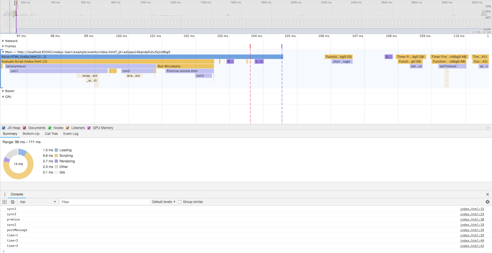

> 阅读前言  
> [js世界里的进程、线程、协程和事件循环](https://github.com/Jmingzi/nodejs-learn/blob/master/%E5%9F%BA%E7%A1%80%E6%A6%82%E5%BF%B5/%E8%BF%9B%E7%A8%8B%E5%92%8C%E7%BA%BF%E7%A8%8B.md?1536919745275)  
> [WebWorker与事件循环](./基础概念/web_worker.md)

随着时间的推移，知识的积累，自己的认知总是在一步步变化着，有些变得深刻、有些得到翻新、有些走向湮灭。

## 1 本文主要内容

- 结合`chrome performance`理解调用栈`call stack`与事件循环`eventloop`
- nodejs中的事件循环和`chrome`里是完全不一样的，从入门认识到理解

## 2 实例与performance分析

```js
function con1() {
  console.log('sync1')
}

function con2() {
  console.log('sync2')
}

function con3() {
  console.log('sync3')
}

con1()

setTimeout(() => {
  console.log('timer1')
}, 0)

const channel = new MessageChannel()
channel.port1.onmessage = () => {
  console.log('postMessage')
}

Promise.resolve().then(() => {
  console.log('promise')
  channel.port2.postMessage('')
  con2()
  setTimeout(() => {
    console.log('timer3')
  })
})

con3()

setTimeout(() => {
  console.log('timer2')
}, 0)
```

打开chrome的隐身模式再打开这个页面，利用performance去分析，这一步是避免chrome插件影响你的分析。



⚠️注意：电脑不同的性能绘制的performance可能不一样。

### 2.1 summary色块含义

我们需要了解浏览器渲染网页的大致过程


- parsing html 构建dom树
- 渲染树的构建，也就是将dom树与css树合并
- 根据渲染树布局
- 绘制渲染树

从performance上可以看到，色块含义

- 黄色为js执行
- 紫色为渲染树正在构建和布局
- 绿色为绘制到屏幕

> 此处引用[从event loop规范探究javaScript异步及浏览器更新渲染时机](https://github.com/aooy/blog/issues/5)

我们分析代码时一般看紫色render的时间，和黄色script的执行时间

以坐标轴来看，x代表执行时间，从左到右一段一段的，我把它理解为一个个的事件循环，主线程不断的在执行这个操作

y代表调用栈`call stack`，从上到下代表从一个执行环境到另一个执行环境

### 2.2 从调用栈的角度看事件队列

我还清楚的记得第一次看eventloop相关时，有这样的分类

- tasks: setTimeout, setInterval, UI rendering
- microtasks: Promise, MutationObserver

严格来讲，`UI rendering`是否属于task有待验证，但它本身是由浏览器的另一个线程去处理的，并且与主线程互相阻塞。

> 执行环境分为全局执行环境、函数执行环境、eval

如果从调用栈的角度考虑它，结合我们上面的performance分析图可以这样理解

从上到下，从左到右，调用栈的顺序依次是

- parse html
- evaluate script 解析js
- compile script，执行全局环境anonymous，发现函数执行环境
- 进入con1执行环境，打印结果；销毁con1执行环境，回到全局环境
- 遇到setTimeout，调用子线程处理timer，将回调放入task队列；遇到MessageChannel，将回调放入事件处理的callback队列;
  task队列分很多种，点击事件、timeout回调、 message回调等
- 遇到Promise，将回调放入microtask队列
- 遇到con3环境并进入，打印结果后销毁当前环境退出；遇到setTimeout，同理调用子线程去处理，并将回调放入task队列
  同一个执行环境下的task，我认为放入的是同一个task队列
- `Run Microtasks`，将postMessage放入到优先级高的task队列中，遇到con2，同理；
  message不属于microtask，而属于一个执行优先级最高的task，因为事件队列本身是有一个默认的执行优先级，不同的浏览器厂商可以设置不同的优先级去为用户提供更多的浏览模式，优化体验。
- 接着调用了message的回调
- timer1
- timer2
- timer3

从中我们可以看到render是穿插进行的，唯一可以确定的是render是在`microtasks`执行完成后运行的，因为可以理解为在浏览器的js世界中，主线程外的其它线程的调用，都是需要task去处理的，那必然是在`microtasks`之后了。

### 2.3 总结

一个eventloop的顺序可以理解为这样

- 全局执行环境开始执行代码
- 遇到新的执行环境则push到调用栈中
- 在同一个执行环境内遇到microtask就放入同一个microtask事件队列
- 当当前执行环境被销毁时，会执行当前环境下的microtasks
- 当调用栈被清空时，开始执行task事件

最后一个例子来加深理解
```js
new Promise(resolve => {
    resolve(1);
    console.log(4)
    Promise.resolve(2).then(e => console.log(e))
    Promise.resolve(5).then(e => console.log(e))
}).then(v => console.log(v))

console.log(3)
// 4
// 3
// 2
// 5
// 1
```

值得阅读的文档

- [详解JavaScript中的Event Loop（事件循环）机制](https://zhuanlan.zhihu.com/p/33058983)
- [从Promise来看JavaScript中的Event Loop、Tasks和Microtasks](https://github.com/creeperyang/blog/issues/21)  评论更丰富
- [从event loop规范探究javaScript异步及浏览器更新渲染时机](https://github.com/aooy/blog/issues/5)  文中描述的先执行task再执行microtask我觉得是错误的

## 3 node中是事件循环模型

> 这里也只是对网络的文章查阅总结

在浏览器中，由浏览器本身去管理进程与线程，但在node中，只有v8解释器，需要node的底层模块来处理这些线程和事件模型，这个模块就是`libuv`

很重要的一点就是在node中，不存在`task`和`microtask`这个概念。

```
   ┌───────────────────────┐
┌─>│        timers         │
│  └──────────┬────────────┘
│  ┌──────────┴────────────┐
│  │     I/O callbacks     │
│  └──────────┬────────────┘
│  ┌──────────┴────────────┐
│  │     idle, prepare     │
│  └──────────┬────────────┘      ┌───────────────┐
│  ┌──────────┴────────────┐      │   incoming:   │
│  │         poll          │<─────┤  connections, │
│  └──────────┬────────────┘      │   data, etc.  │
│  ┌──────────┴────────────┐      └───────────────┘
│  │        check          │
│  └──────────┬────────────┘
│  ┌──────────┴────────────┐
└──┤    close callbacks    │
   └───────────────────────┘
```

事件模型的各个阶段，起始由外部发起请求开始

### 3.1 nextTick 与 setImmediate

当事件进入下个阶段前，会检查next queen中是否为空，不为空则执行`process.nextTick`，也就是说不能循环递归去调用`process.nextTick`，因为这样会造成死循环。

setImmediate在check阶段执行

### 3.2 阶段详解

- #### timer

执行setTimeout、setInterval的回调

- #### I/O callbacks

并不是所有I/O的回调都在这里执行，官网上举的例子是

> For example if a TCP socket receives ECONNREFUSED when attempting to connect, some unix systems want to wait to report the error. This will be queued to execute in the I/O callbacks phase

意思是对于`TCP socket`的`ECONNREFUSED`错误，在unix系统中会被放到这个阶段去执行回调

而用户操作的有关I/O的回调其实都是`EventEmitter`的实例，也就是events事件。

- #### poll

这个阶段做2件事情

1、判断有没有timer
2、执行events回调，这里的回调事件就包括很多了，只要是`EventEmitter`的实例都会在此处执行

通常上来讲，随着代码的执行，eventloop最终会停留在`poll`阶段，等待新的事件。

- #### check

这个阶段被专门用来执行`setImmediate`的回调，当`poll`阶段空闲且存在`setImmediate`时，会立刻进入check阶段


### 3.3 总结

poll阶段是处理绝大部分events回调的阶段，除了`setImmediate`和`timer`，此外，poll阶段的循环也是有限制的。

值得阅读的文档

- [Node.js的event loop及timer/setImmediate/nextTick](https://github.com/creeperyang/blog/issues/26) 原文及评论很有参考意义
> 首先I/O callbacks这个阶段，名字有点误导，并不是所有I/O的回调都在这里执行，官网上举的例子是
  > For example if a TCP socket receives ECONNREFUSED when attempting to connect, some *nix systems want to wait to report the error. This will be queued to execute in the I/O callbacks phase
> 而fs.readFile的回调是在poll执行的，我的理解是fs.readFile调用了操作系统的API，文件读完之后通过event的方式通知V8，而event的处理是在`poll阶段
> poll阶段执行两件事情，上面已经说的很清楚了，一是判断哪些timer需要执行回调，一是处理event的回调。node的很多api都是基于事件订阅完成的，比如readStream的data，这些api的回调应该都在poll阶段完成

- [详解JavaScript中的Event Loop（事件循环）机制](https://zhuanlan.zhihu.com/p/33058983)

