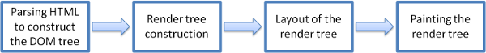

> 阅读前言  
> [js世界里的进程、线程、协程和事件循环](https://github.com/Jmingzi/nodejs-learn/blob/master/%E5%9F%BA%E7%A1%80%E6%A6%82%E5%BF%B5/%E8%BF%9B%E7%A8%8B%E5%92%8C%E7%BA%BF%E7%A8%8B.md?1536919745275)  
> [WebWorker与事件循环](./基础概念/web_worker.md)

随着时间的推移，知识的积累，自己的认知总是在一步步变化着，有些变得深刻、有些得到翻新、有些走向湮灭。

## 1 本文主要内容

- 结合`chrome performance`理解调用栈`call stack`与事件循环`eventloop`
- nodejs中的事件循环和`chrome`里是完全不一样的，从入门认识到理解

## 2 实例与performance

```js
function con1() {
  console.log('sync1')
}

function con2() {
  console.log('sync2')
}

function con3() {
  console.log('sync3')
}

con1()

setTimeout(() => {
  console.log('timer1')
}, 0)

const channel = new MessageChannel()
channel.port1.onmessage = () => {
  console.log('postMessage')
}

Promise.resolve().then(() => {
  console.log('promise')
  channel.port2.postMessage('')
  con2()
  setTimeout(() => {
    console.log('timer3')
  })
})

con3()

setTimeout(() => {
  console.log('timer2')
}, 0)
```

打开chrome的隐身模式再打开这个页面，利用performance去分析，这一步是避免chrome插件影响你的分析。


### 2.1 summary色块

我们需要了解浏览器渲染网页的大致过程



- parsing html 构建dom树
- 渲染树的构建，也就是将dom树与css树合并
- 根据渲染树布局
- 绘制渲染树

从performance上可以看到，色块含义

- 黄色为js执行
- 紫色为渲染树正在构建和布局
- 绿色为绘制到屏幕

我们分析代码时一般看紫色render的时间，和黄色script的执行时间


