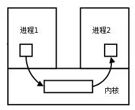

## 前言

我们之前讲过`套接字`的概念，其中就涉及最初的socket的设计就是为了进程间的通信，这里IPC就是指的进程间通信，而套接字是其中的一种方式

> 进程之间是不能共享数据与资源的，而线程可以。

> 每个进程各自有不同的用户地址空间，任何一个进程的全局变量在另一个进程中都看不到，所以进程之间要交换数据必须通过内核，在内核中开辟一块缓冲区，进程1把数据从用户空间拷到内核缓冲区，进程2再从内核缓冲区把数据读走，内核提供的这种机制称为进程间通信（IPC，InterProcess Communication）

## 实现IPC的几种机制

### 1. 套接字(socket)

详细请戳[套接字概念](./socket.md)

### 2. Linux信号(Signal)机制

### 3. 传统的Unix通信机制

### 4. 消息(Message)队列
