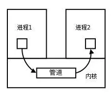

## 前言

我们之前讲过`套接字`的概念，其中就涉及最初的socket的设计就是为了进程间的通信，这里IPC就是指的进程间通信，而套接字是其中的一种方式

> 进程之间是不能共享数据与资源的，而线程可以。

> 每个进程各自有不同的用户地址空间，任何一个进程的全局变量在另一个进程中都看不到，所以进程之间要交换数据必须通过内核，在内核中开辟一块缓冲区，进程1把数据从用户空间拷到内核缓冲区，进程2再从内核缓冲区把数据读走，内核提供的这种机制称为进程间通信（IPC，InterProcess Communication）


## 实现IPC的几种机制

### 1. 套接字(socket)

详细请戳[套接字概念](./socket.md)

### 2. Linux信号(Signal)机制

在将`process.kill()`时，提到了node中的`信号事件`，[传送门](https://github.com/Jmingzi/nodejs-learn/blob/master/%E5%9F%BA%E7%A1%80%E6%A8%A1%E5%9D%97/process.md#22-process%E7%9A%84%E6%96%B9%E6%B3%95)，我想应该是Node借用了这一机制

- 信号是Linux系统中用于进程间互相通信或者操作的一种机制，信号可以在任何时候发给某一进程，而无需知道该进程的状态。
- 如果该进程当前并未处于执行状态，则该信号就有内核保存起来，知道该进程回复执行并传递给它为止。
- 如果一个信号被进程设置为阻塞，则该信号的传递被延迟，直到其阻塞被取消是才被传递给进程。

***信号来源***
信号是软件层次上对中断机制的一种模拟，是一种异步通信方式，信号可以在用户空间进程和内核之间直接交互，内核可以利用信号来通知用户空间的进程发生了哪些系统事件，信号事件主要有两个来源：

- 硬件来源：用户按键输入Ctrl+C退出、硬件异常如无效的存储访问等。
- 软件终止：终止进程信号、其他进程调用kill函数、软件异常产生信号。

### 3. 传统的Unix通信机制 - 管道/匿名管道(pipe)

看到`pipe`，我们会很熟悉，在stream中，实例就拥有pipe方法

```js
const writer = getWritableStreamSomehow()
const reader = getReadableStreamSomehow()
writer.on('pipe', (src) => {
  console.error('有数据正通过管道流入写入器')
  assert.equal(src, reader)
})
reader.pipe(writer)
```

上面的例子是管道将可读流与可写流对接起来了。为什么需要管道呢？这个问题应该是为什么需要流`stream`，可以回顾`stream`章节的知识点。

查看[node源码](https://github.com/nodejs/node/blob/master/lib/_stream_readable.js#L591)发现
```js
Readable.prototype.pipe = function(dest, pipeOpts)
```
pipe函数接收的第一个参数为可写流目标，通过将可读流读取的数据再管道中提供给可写流

在`net.Socket`中，我们会看到这种写法
```js
socket.pipe(socket)
```

因为socket是读写流，可以pipe他自己以便继续利用管道对接数据。

#### 管道的实质



管道的实质是一个内核缓冲区，进程以先进先出的方式从缓冲区存取数据，管道一端的进程顺序的将数据写入缓冲区，另一端的进程则顺序的读出数据。

该缓冲区可以看做是一个循环队列，读和写的位置都是自动增长的，不能随意改变，一个数据只能被读一次，读出来以后在缓冲区就不复存在了。

当缓冲区读空或者写满时，有一定的规则控制相应的读进程或者写进程进入等待队列，当空的缓冲区有新数据写入或者满的缓冲区有数据读出来时，就唤醒等待队列中的进程继续读写。

### ~~~4. 消息(Message)队列~~~

以上参考

- [进程间通信IPC (InterProcess Communication)](https://www.jianshu.com/p/c1015f5ffa74)
- [stream pipe的原理及简化源码分析](https://juejin.im/post/5a75403ef265da4e7c185b3b)
