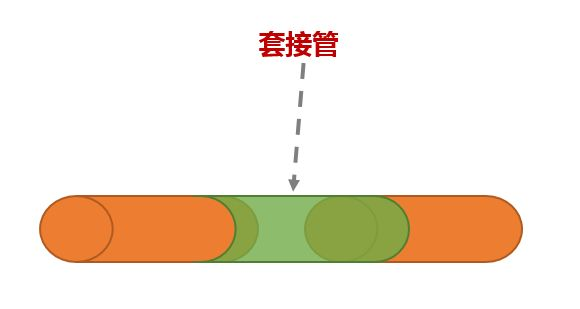
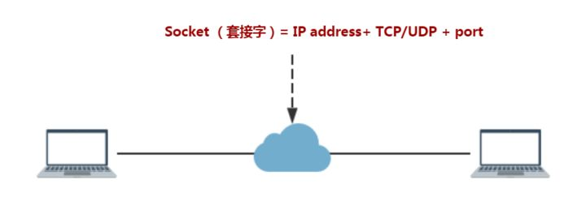

我们先从`形`上来理解：

套接字其实是`socket`的中文翻译，直接去搜索socket的翻译会发现是`插座`的意思，这其实是在硬件领域的表现。

在软件领域，应该理解为`套接`和`字`，套接就是将2端连接起来的中间部分，如图所示

那`字`呢，在计算机中，程序指令的最小单位是字节，那就可以理解为`字`就是表示"可交互的程序指令"

此段参考：[Socket为什么要翻译成套接字？](https://www.zhihu.com/question/21383903)

再从原理概念上来说：

> 生成套接字，主要有3个参数：通信的目的IP地址、使用的传输层协议(TCP或UDP)和使用的端口号。

socket最早是用来应用程序进程间的相互通信，要通过互联网进行通信，至少需要一对套接字，一个运行于客户机端，称之为ClientSocket，另一个运行于服务器端，称之为serverSocket。

根据连接启动的方式以及本地套接字要连接的目标，套接字之间的连接过程可以分为三个步骤：服务器监听，客户端请求，连接确认。

此段参考：[(转)什么是套接字(Socket)？](https://www.cnblogs.com/ruanbl/archive/2007/10/22/933430.html)
