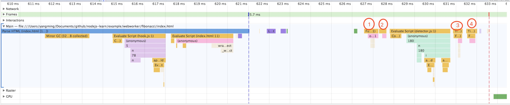

## 概述
web Worker会创建线程，和浏览器运行的的其他线程一样，可以与主线程进行数据传输而不影响主线程的运行

在worker运行的脚本内，全局对象不是`window`而是`DedicatedWorkerGlobalScope`，所以在worker里我们可以使用全局对象的属性和在主线程里一样。

## worker的限制

我们可以在控制台查看worker全局对象的属性发现：

跟`ServiceWorker`对象的属性很相似，简要列出几个：

```js
worker.terminate() // 主线程主动关闭子线程
self.caches // 缓存api
self.close()    // 子线程自己关闭
self.location   // 主线程的location
self.postMessage()  // 发送消息
slef.Blob
slef.importScripts()    // 下载js文件，同步执行
self.onmessage  // 事件接收
```

## worker的分类

- 专用worker `Worker`，全局对象`DedicatedWorkerGlobalScope`
- 共享worker `SharedWorker`，全局对象`SharedWorkerGlobalScope`
- 服务worker `ServiceWorker`

## Worker构造函数

```js
new Worker(aURL[, options])
```

aURL为字符串，必须为同源下的可执行js文件或`Data URL`，什么是`Data URL`？

> Data URLs 由四个部分组成：前缀(data:)、指示数据类型的MIME类型、如果非文本则为可选的base64标记、数据本身：

```js
data:[<mediatype>][;base64],<data>
```

完整示例：

```js
const sub = function(e) {
    console.log(`i am from data urls, ${e.data}`)
}
const url = encodeURIComponent(`onmessage=${sub.toString()}`)

const worker = new Worker(`data:text/javascript;charset=US-ASCII,${url}`)
worker.postMessage('hi')
// 输出 i am from data urls, hi
```

我们可以利用`URL.createObjectURL`来创建Data urls，它接受一个Blob对象或者File对象

```js
const sub = function(e) {
    console.log(`i am from data urls, ${e.data}`)
}
const url = `onmessage=${sub.toString()}`
const blob = new Blob([url], { type: 'text/javascript' })
const worker = new Worker(URL.createObjectURL(blob))
worker.postMessage('hi')
URL.revokeObjectURL(url) // 释放已经存在的 URL 对象
// 输出 i am from data urls, hi
```

详细请见[data_URIs](https://developer.mozilla.org/zh-CN/docs/Web/HTTP/data_URIs)、[Blob](https://developer.mozilla.org/zh-CN/docs/Web/API/Blob)、[URL](https://developer.mozilla.org/zh-CN/docs/Web/API/URL)

## worker中数据的接收与发送

> 在主页面与 worker 之间传递的数据是通过拷贝，而不是共享来完成的。传递给 worker 的对象需要经过序列化，接下来在另一端还需要反序列化。页面与 worker 不会共享同一个实例，最终的结果就是在每次通信结束时生成了数据的一个副本。大部分浏览器使用结构化拷贝来实现该特性。

什么是结构化拷贝？

> 结构化克隆算法是由HTML5规范定义的用于复制复杂JavaScript对象的算法

支持的类型js类型

对象类型|注意
----|-----
基础类型|
Array|
Object|
RegExp|lastIndex 字段不会被保留。
Blob|
File|
FileList|
ArrayBuffer|
ImageData|
Map|
Set|

不支持的类型

- `Error`
- `Function`
- `HTMLElement`
- 原形链上的属性也不会被追踪以及复制

详细请见[MDN](https://developer.mozilla.org/zh-CN/docs/Web/Guide/API/DOM/The_structured_clone_algorithm)

举几个例子来实践下

```js
// 1. 传递函数
const worker = new Worker('./worker.js')
worker.postMessage(() => {})
// Uncaught DOMException: Failed to execute 'postMessage' on 'Worker': ()=>{} could not be cloned.

// 2. 传递原型链
const worker = new Worker('./worker.js')
const Person = function () {
  this.name = 'ym'
}
Person.prototype.age = 18
worker.postMessage(new Person())
// {
//    name: 'ym',
//    __proto__: Object
// }
```

## 传输机制带来的问题与解决办法

>主线程与子线程之间也可以交换二进制数据，比如File、Blob、ArrayBuffer等对象，也可以在线程之间发送。但是，用拷贝方式发送二进制数据，会造成性能问题。比如，主线程向子线程发送一个50MB文件，默认情况下浏览器会生成一个原文件的拷贝。为了解决这个问题，JavaScript允许主线程把二进制数据直接转移给子线程，转移后主线程无法再使用这些数据，这是为了防止出现多个线程同时修改数据的问题，这种转移数据的方法，叫做Transferable Objects。

```js
worker.postMessage(aMessage[, transferList])
```

transferList

一个可选的Transferable对象的数组，用于传递所有权。如果一个对象的所有权被转移，在发送它的上下文中将变为不可用（中止），并且只有在它被发送到的worker中可用。
可转移对象是如ArrayBuffer，MessagePort或ImageBitmap的实例对象。transferList数组中不可传入null。

## importScripts

Worker 线程能够访问一个全局函数importScripts()来引入脚本，该函数接受0个或者多个URI作为参数来引入资源

脚本的下载顺序不固定，但执行时会按照传入 importScripts() 中的文件名顺序进行。这个过程是同步完成的；直到所有脚本都下载并运行完毕，importScripts() 才会返回。

## postMessage与eventloop

postMessage属于`task`或者说`macrotask`，为什么呢？

在eventloop中，先将task队列push到call stack中，在push执行的过程中，步骤为

- 取出一个task运行
- 运行结束，将`current running task`置为null
- 移除这个task
- 执行`microtask checkpoint`任务检查点
- 有microtask则push到call stack中立即执行
- 更新渲染UI，`update the rendering`

了解这个顺序后再举个例子

```js
  setTimeout(function setTimeout1(){
    console.log('setTimeout1')
  }, 0)
  var channel = new MessageChannel();
  channel.port1.onmessage = function onmessage1 (){
    console.log('postMessage')
    Promise.resolve().then(function promise1 (){
      console.log('promise1')
    })
  };
  channel.port2.postMessage(0);
  setTimeout(function setTimeout2(){
    console.log('setTimeout2')
  }, 0)
  console.log('sync')
  // sync
  // postMessage
  // promise1
  // setTimeout1
  // setTimeout2
```

我们可以发现是先执行了`postMessage`也就是`task`



根据执行顺序

- 先将script push到call stack，`Evaluate Script`
- 执行microtask checkpoint，没有microtask
- 执行render

重复以上步骤，就是不断的执行eventloop，其中1是`onmessage`task，2是`microtask`的promise，3和4是下一个循环的`timeout`

[从event loop规范探究javaScript异步及浏览器更新渲染时机](https://github.com/aooy/blog/issues/5)

----

以上参考[MDN Worker](https://developer.mozilla.org/zh-CN/docs/Web/API/Worker)、[【转向Javascript系列】深入理解Web Worker](http://www.alloyteam.com/2015/11/deep-in-web-worker/)