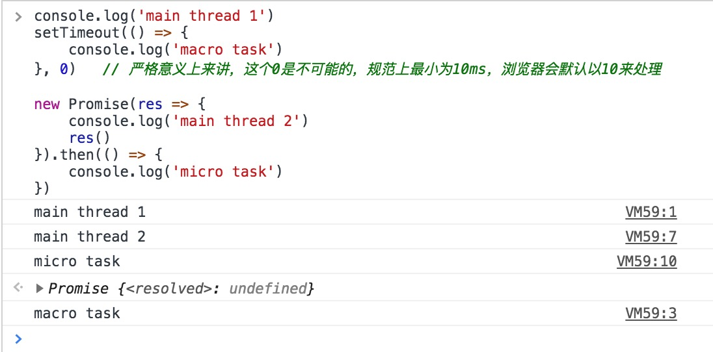
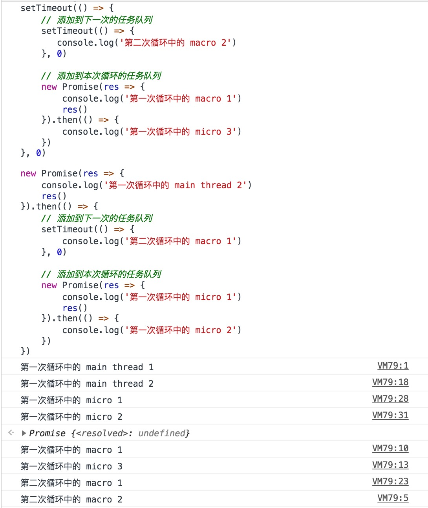

## 目录
本文阐述的内容为，在js的世界中，进程、线程、协程以及EventLoop的存在

## 概念

### 进程process

进程是程序执行的实例，程序只是一些指令的描述集合，一个CPU总是运行一个进程。

不同的进程之间不能通信，拥有独立的内存，是操作系统进行资源分配和调度的一个独立单位。

### 线程Thread

进程是线程的容器，一个进程中有一个或多个线程。线程是独立调度和分派的基本单位，换句话说是程序执行的最小单位，而进程是操作系统中资源分配的最小单位。

[wiki进程](https://zh.wikipedia.org/wiki/%E8%A1%8C%E7%A8%8B)、[wiki线程](https://zh.wikipedia.org/wiki/%E7%BA%BF%E7%A8%8B)


#### 举个例子

chrome浏览器，新开一个tab就是新开一个进程，一个tab打开的一个网页，里面有js引擎执行、http请求、页面渲染等，这些被称为线程。

新开一个tab的本质也就是新建一个浏览器实例，这说明浏览器内核是多线程的，浏览器的常驻线程有

- GUI 渲染线程
-  JavaScript引擎线程
-  定时触发器线程
-  事件触发线程
-  异步http请求线程

### 协程Coroutine

由于在浏览器的js的世界中，它的存在微弱，我似乎都不曾听说过这个概念。理解它，常常需要借助[子程序](https://zh.wikipedia.org/wiki/%E5%AD%90%E7%A8%8B%E5%BA%8F)的概念，也就是纯函数，纯函数我们知道，只有入参出参，内部无副作用，一旦执行完毕，该函数就会被销毁。

而协程呢？在一个协程里，一个入参出参结束后，又会进入到下一个入参中。

协程有点像函数，又有点像线程。它的运行流程大致如下

- 第一步，协程A开始执行。
- 第二步，协程A执行到一半，进入暂停，执行权转移到协程B。
- 第三步，（一段时间后）协程B交还执行权。
- 第四步，协程A恢复执行。

用es6的`Generator`函数来举例子

```js
function* gen(x){
  var y = yield x + 2
  return y
}

var g = gen(1)
g.next() // { value: 3, done: false }
g.next(2) // { value: 2, done: true }
```

流程为
- 协程gen开始执行
- 暂停执行，执行协程b，`x+2`
- 协程b执行完成，协程gen继续执行

它可以中断程序的执行，协程的切换由用户手动来控制，就好比说，切换线程由用户切换的一样。

协程的作用是什么？

由于我几乎不怎么用，不能体会到，但我想，在浏览器的js世界里，优化代码组织结构？

参考，[协程的好处有哪些？](https://www.zhihu.com/question/20511233)、[Generator 函数的含义与用法](http://www.ruanyifeng.com/blog/2015/04/generator.html)

### 事件循环EventLoop

如果要以线程的概念来理解，应该是这样的

- js v8引擎是主线程
- 浏览器中除了v8外，还有其它线程
    - GUI 渲染线程
    - 定时器线程
         因为如果不新开只线程去处理定时器，那定时器的计时是会阻塞当前线程代码的，在执行栈中，代码从上到下执行，定时器下面的代码必须等到计时完毕才能继续执行。
    - http请求线程
    - 事件处理也是线程

我们常说的js单线程，是指v8引擎单线程，因为它是解析运行js代码的主线程。

结合事件循环机制的概念，在js中，分为**同步**和**异步**任务，同步任务在主线程中（也就是v8引擎），形成**执行栈**；

异步任务会被添加到**任务队列**中（那谁去处理这个添加呢？就是这些子线程），当主线程中的执行栈为空时，就从异步任务队列（回调函数组成）里取回调执行。这个重复的过程，就称为事件循环。

另外，任务队列又分为`macro`和`micro`，中文上我称之为`宏`和`微`

- macro-task: ~~~script（这个具体指的什么？）~~~, setTimeout, setInterval, setImmediate, I/O, UI rendering
- micro-task: process.nextTick, Promises（这里指浏览器实现的原生 Promise）, Object.observe, MutationObserver

在任务队列中，也是有执行顺序的，分2种情况

- 在执行过程中不产生新的任务时，是先执行完`micro`再去执行`macro`
- 在执行的过程中产生新的`macro`和`micro`时，`micro`会被添加到当前执行队列中，`macro`则被添加到下一次循环的任务队列中。也就是说新产生的`micro`也会在本次循环中执行。

分别举例子

例子1：

```js
console.log('main thread 1')
setTimeout(() => {
    console.log('macro task')
}, 0)   // 严格意义上来讲，这个0是不可能的，规范上最小为10ms，浏览器会默认以10来处理

new Promise(res => {
    console.log('main thread 2')
    res()
}).then(() => {
    console.log('micro task')
})
```



例子2，基于例子1修改，新增任务即可：

```
console.log('第一次循环中的 main thread 1')
setTimeout(() => {
    // 添加到下一次的任务队列
    setTimeout(() => {
       console.log('第二次循环中的 macro 2')
    }, 0)

    // 添加到本次循环的任务队列
    new Promise(res => {
        console.log('第一次循环中的 macro 1')
        res()
    }).then(() => {
        console.log('第一次循环中的 micro 3')
    })
}, 0)

new Promise(res => {
    console.log('第一次循环中的 main thread 2')
    res()
}).then(() => {
    // 添加到下一次的任务队列
    setTimeout(() => {
        console.log('第二次循环中的 macro 1')
    }, 0)

    // 添加到本次循环的任务队列
    new Promise(res => {
        console.log('第一次循环中的 micro 1')
        res()
    }).then(() => {
        console.log('第一次循环中的 micro 2')
    })
})

setTimeout(() => {
  console.log('第一次循环中的 macro 2')
}, 0)
```



参考

- [浏览器进程？线程？傻傻分不清楚！](http://imweb.io/topic/58e3bfa845e5c13468f567d5)
- [Javascript 单线程模型 Event Loop 机制](https://github.com/Monine/study/issues/16)
