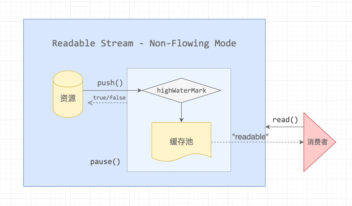
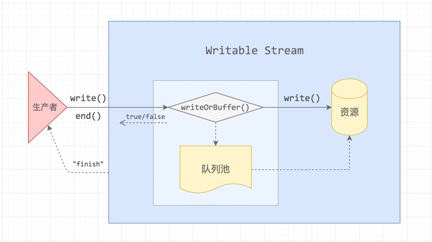
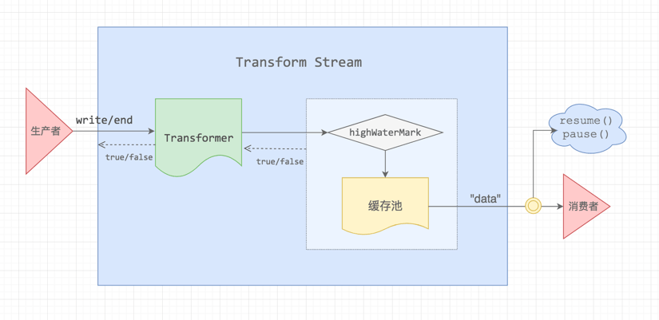

# 深入理解stream

> 第一篇为 [stream入门](../基础模块/stream.md)

要深入理解的话得结合源码来看

```js
// _stream_readable.js
// _stream_writable.js
// _stream_duplex.js
// _stream_transform.js
```

## 可读流

可读流的3种状态

- _readableState.flow = null，暂时没有消费者过来


- _readableState.flow = false，主动触发了 .pause()

    当我们监听了onreadable事件后会进入暂停模式

- _readableState.flow = true，流动模式

    当我们监听ondata事件就会进入流动模式

### 流动模式


数据先被写入到内存，内存有一个上限`highWaterMark`，写入时会同时触发data事件，传给消费者。以下2种情况下会触发`背压`

- 消费者主动执行了 .pause()
- 消费速度比数据 push 到缓存池的生产速度慢

### 暂停模式



数据写入内存时，会触发`readable`事件，消费者需要手动调用`read`方法去内存中读取数据

调用`read(size)`，可以指定字节数，当内存中的数据长度不够时，返回null，够了才一次性读取完

### 通过API实现可读流

有2种方式
```js
// 通过构造函数
new stream.Readable({
    highWaterMark: 16384,
    read(){}
})

// 通过es6
class MyReadable extends Readable {
  constructor(options) {
    // 调用 stream.Readable(options) 构造函数。
    super(options);
    // ...
  }
  _read() {
    this.push(buf)
  }
}
```

## 可写流



原理与 Readable Stream 是比较相似的，数据流过来的时候，会直接写入到资源池，当写入速度比较缓慢或者写入暂停时，数据流会进入队列池缓存起来。

当生产者写入速度过快，把队列池装满了之后，就会出现「背压」，这个时候是需要告诉生产者暂停生产的，当队列释放之后，Writable Stream 会给生产者发送一个 drain 消息，让它恢复生产。

背压机制是流内部实现的，当写入内存的速度过快，就会暂停写入。当数据块被处理完成后的回调callback函数，此时触发`drain`事件，告诉生产者可以继续生产

### 通过API实现可写流

同理通过构造函数

```js
const myWritable = new Writable({
  // 需要注意的是callback必须被回调
  // 如果调用失败，则 callback 的第一个参数必须是 Error 对象。 如果写入成功，则 callback 的第一个参数为 null
  write(chunk, encoding, callback) {
    // ...
  }
})
```

## pipe

将可读流和可写流通过管道连接起来

```js
readable.pipe(writable)
```

可读流将获取的数据，传递给可写流的write

```js
Readable.prototype.pipe = function(dest, pipeOpts) {
  // 绑定end事件
  this.once('end', () => {
    dest.end()
  })

  // 背压恢复时的回调
  dest.on('drain', readable => {
    // 流动模式
    state.flowing = true
    // flow(readable)
    while (state.flowing && readable.read() !== null)
  })

  // 可读流监听
  src.on('data', chunk => {
    var ret = dest.write(chunk)
    if (ret === false) {
      src.pause()
    }
  })

  // 触发可写流的pipe事件，告知它有流要写入
  dest.emit('pipe', src)

  // 可写流可以通过pipe获取写入数据的可读流，实现链式调用
  return dest
}
```

## 双工流

查看源码我们发现，Duplex是继承Readable的

```js
util.inherits(Duplex, Readable)
```

同时拥有Writable原型上的所有方法

```js
{
  // Allow the keys array to be GC'ed.
  const keys = Object.keys(Writable.prototype);
  for (var v = 0; v < keys.length; v++) {
    const method = keys[v];
    if (!Duplex.prototype[method])
      Duplex.prototype[method] = Writable.prototype[method];
  }
}
```

那我们可以发现，可读流与可写流之间是没有直接联系的，也就是说一个双工流也可以是只读流、只写流、还有一种称为半工流（也就是只读或者只写）

```js
// 通过参数控制
if (options) {
    if (options.readable === false)
      this.readable = false;

    if (options.writable === false)
      this.writable = false;

    if (options.allowHalfOpen === false) {
      this.allowHalfOpen = false;
      this.once('end', onend);
    }
}

// the no-half-open enforcer
function onend() {
  // If the writable side ended, then we're ok.
  if (this._writableState.ended)
    return;

  // no more data can be written.
  // But allow more writes to happen in this tick.
  process.nextTick(onEndNT, this);
}

function onEndNT(self) {
  self.end();
}
```

可以看出`allowHalfOpen`先判断可写流是否end，如果不是则手动调用可读流end：`this.end()`，因为this指向`readable`。

## 转换流



它是直接继承的双工流
```js
  util.inherits(Transform, Duplex)

  // 然后支持传递transform和flush函数重写转换
  if (options) {
    if (typeof options.transform === 'function')
      this._transform = options.transform;

    if (typeof options.flush === 'function')
      this._flush = options.flush;
  }
```

实现转换流的例子，可读流与可写流的关联在内部实现了，暴露给我们的`_transform`和`_flush`方法，只需要将数据经过处理后push并回调即可。
```js
const Transform = require('stream').Transform;
const MAP = {
  'Barret': '靖',
  'Lee': '李'
};

class Translate extends Transform {
  constructor(dataSource, options) {
    super(options);
  }
  _transform(buf, enc, next) {
    const key = buf.toString();
    const data = MAP[key];
    this.push(data);
    next();
  }
}

var transform = new Translate();
transform.on('data', data => console.log(data.toString()));
transform.write('Lee');
transform.write('Barret');
transform.end();
```

关于`_flush`，查看源码可以发现，通过`prefinish`事件触发，也就是说我们可以手动`emit('prefinish')`，来触发`_flush`

```js
flush(callback) {
  // 正常时error为null
  // data为你额外需要写入流的数据
  callback(error, data)
}

function prefinish() {
  if (typeof this._flush === 'function' && !this._readableState.destroyed) {
    this._flush((er, data) => {
      done(this, er, data);
    });
  } else {
    done(this, null, null);
  }
}

function done(stream, er, data) {
  if (er)
    return stream.emit('error', er);

  if (data != null) // single equals check for both `null` and `undefined`
    stream.push(data);

  return stream.push(null);
}
```

参考: [深入理解 Node.js Stream 内部机制](http://taobaofed.org/blog/2017/08/31/nodejs-stream/)
