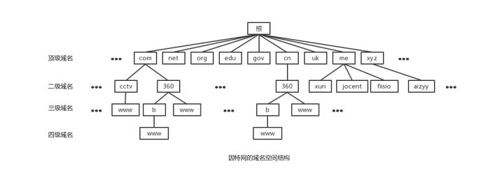

> 本章涉及dns查询工具[dig的使用](../基础概念/dig.md)

## 前言

我们都知道dns的作用是将域名解析为ip地址，dns是一个服务器，它也有自己的ip地址。那么第一个问题就出现了

- [dns服务器是如何分配的？或者如何设置的](#dns服务器)

清楚dns服务器的来源后，我们从解析域名的后台面板开始，如下图：


我们需要清楚几个名词

- 记录类型
    - A     ip地址
    - NS    名称服务器地址
    - CNAME 别名
- 记录值
    类型相应的值
- TTL
    查询缓存的时间，单位s，默认是10分钟，也就是600s

## dns服务器

先来了解域名的结构，每个域名其实看起来是这样的

```
iming.work.
```

末尾是有个点的，代表根域名，每一级域名都有自己的服务器。具体如图所示



- 根域名服务器
    全球只存在13台根域名服务器，国内有3台，当一个域名请求发出时，会查询离你最近的那台，每台根域名服务器包含了顶级域名的NS记录，而只有NS才知道下一级域名的相关信息。查询到顶级域名服务器的相关信息后将结果返回给请求者。
- 顶级域名服务器
     负责管理在该顶级域名服务器下注册的二级域名，请求者拿到根域名服务器的返回再次请求顶级域名服务器，去获取二级域名的相关信息。
- 权限域名服务器
    负责一个区的域名解析工作

你的电脑在没有配置dns服务器地址的时候就能上网是为什么呢？我们需要知道`DHCP`

全称是`Dynamic Host Configuration Protocol`，翻译过来是动态配置主机协议的服务器，通过DHCP协议获取IP、DNS、网关等。也就是说，一开始我们通过`DHCP`查询到本地`DNS服务器`

> 关于DHCP的工作原理可以查阅这3篇文章[DHCP服务器](https://www.jianshu.com/p/a2e1db7ac919)、[初始DNS服务器地址是哪里来的？](https://www.jianshu.com/p/daff7e0c1e3b)和[DHCP和DNS服务器的一些功能讲解](http://blog.51cto.com/vbers/2050140)

另外，我们也可以直接指定公网的`DNS服务器`地址去做解析，例如google的
```
8.8.8.8
4.2.2.2
```

## dns查询方式

查询方法分为2种，一种是递归查询，一种是迭代查询

递归查询如下图所示


主机向本地域名服务器的查询一般都是采用递归查询。所谓递归查询就是：如果主机所询问的本地域名服务器不知道被查询的域名的IP地址，那么本地域名服务器就以DNS客户的身份，向其它根域名服务器继续发出查询请求报文(即替主机继续查询)，而不是让主机自己进行下一步查询。因此，递归查询返回的查询结果或者是所要查询的IP地址，或者是报错，表示无法查询到所需的IP地址。

迭代查询如下图所示


本地域名服务器向根域名服务器的查询的迭代查询。迭代查询的特点：当根域名服务器收到本地域名服务器发出的迭代查询请求报文时，要么给出所要查询的IP地址，要么告诉本地服务器：“你下一步应当向哪一个域名服务器进行查询”。然后让本地服务器进行后续的查询。

参考
- [DNS中的递归查询和迭代查询](https://www.jianshu.com/p/fc14b1526605)
- [例解DNS递归/迭代名称解析原理](https://blog.csdn.net/lycb_gz/article/details/11720247)

## 实例分析
> 我们用dig工具来简要查看，而不是使用Wireshark。

```sh
dig +trace iming.work

; <<>> DiG 9.10.6 <<>> iming.work +trace
;; global options: +cmd
.			277528	IN	NS	e.root-servers.net.
.			277528	IN	NS	h.root-servers.net.
.			277528	IN	NS	d.root-servers.net.
.			277528	IN	NS	k.root-servers.net.
.			277528	IN	NS	b.root-servers.net.
.			277528	IN	NS	m.root-servers.net.
.			277528	IN	NS	f.root-servers.net.
.			277528	IN	NS	j.root-servers.net.
.			277528	IN	NS	l.root-servers.net.
.			277528	IN	NS	i.root-servers.net.
.			277528	IN	NS	c.root-servers.net.
.			277528	IN	NS	g.root-servers.net.
.			277528	IN	NS	a.root-servers.net.
;; Received 503 bytes from 10.0.10.100#53(10.0.10.100) in 14 ms

work.			172800	IN	NS	dns3.nic.work.
work.			172800	IN	NS	dns2.nic.work.
work.			172800	IN	NS	dnsd.nic.work.
work.			172800	IN	NS	dnsc.nic.work.
work.			172800	IN	NS	dnsb.nic.work.
work.			172800	IN	NS	dnsa.nic.work.
work.			172800	IN	NS	dns1.nic.work.
work.			172800	IN	NS	dns4.nic.work.
;; Received 798 bytes from 198.41.0.4#53(a.root-servers.net) in 203 ms

iming.work.		172800	IN	NS	dns19.hichina.com.
iming.work.		172800	IN	NS	dns20.hichina.com.
;; Received 841 bytes from 103.49.81.35#53(dns2.nic.work) in 396 ms

iming.work.		600	IN	A	116.62.70.156
;; Received 55 bytes from 106.11.211.58#53(dns20.hichina.com) in 43 ms
```

> 查询结果省略了部分。

从上面的返回可以看出

- 查询是分为4步的，且省略了本地dns服务器查询这一步骤
- 查询到根域名服务器a-m
- 每一级域名服务器的查询都是有TTL缓存时间的，根域名设置的277528s、其它是172800s，而A记录是我们自己设置的600s

具体的流程：

- 在电脑开机的时候，通过DHCP获取到本机IP和DNS等
- 在请求`iming.work`域名时，先向本地DNS发起请求
- 本地DNS向根域名服务器发起请求，返回所有该顶级域名`work.`的相关信息（ns及ip等）
- 本地DNS向顶级域名服务器发起请求，返回`iming.work.`的相关信息
- 本地DNS向权限服务器发起请求，根据你自己配置的A记录，返回ip地址
- 本地DNS将ip地址返回给请求者

可以看到，查询方式其实是先进行的递归，再迭代查询的。

上面的NS记录，其实就是指定dns解析服务器地址，也类似

```
dig @8.8.8.8 iming.work
```

参考：

- [关于DNS服务器的原理和配置](https://zhuanlan.zhihu.com/p/29791932)
- [DNS 原理入门](http://www.ruanyifeng.com/blog/2016/06/dns.html)
- [DNS与NS、NS记录](https://www.cnblogs.com/yingsong/p/4429637.html)

## dns劫持

DNS劫持就是通过劫持了DNS服务器，通过某些手段取得某域名的解析记录控制权，进而修改此域名的解析结果，导致对该域名的访问由原IP地址转入到修改后的指定IP。

另外，常见的攻击手段有

- http劫持
- dns劫持

    [DNS劫持与DNS污染的原理](https://www.jianshu.com/p/283726054240)
- arp欺骗

    [中间人攻击——ARP欺骗的原理、实战及防御](http://netsecurity.51cto.com/art/201303/386031.htm)

什么是网关？

网关(Gateway)又称网间连接器、协议转换器。网关在传输层上以实现网络互连，是最复杂的网络互连设备，仅用于两个高层协议不同的网络互连。网关的结构也和路由器类似，不同的是互连层。网关既可以用于广域网互连，也可以用于局域网互连。 网关是一种充当转换重任的计算机系统或设备。在使用不同的通信协议、数据格式或语言，甚至体系结构完全不同的两种系统之间，网关是一个翻译器。与网桥只是简单地传达信息不同，网关对收到的信息要重新打包，以适应目的系统的需求。同时，网关也可以提供过滤和安全功能。大多数网关运行在OSI 7层协议的顶层--应用层。

参考
- [新手教程：局域网DNS劫持实战](https://www.freebuf.com/articles/network/131385.html)
- [什么是网关，网关的作用是什么？](https://www.jianshu.com/p/122ac247f772)

