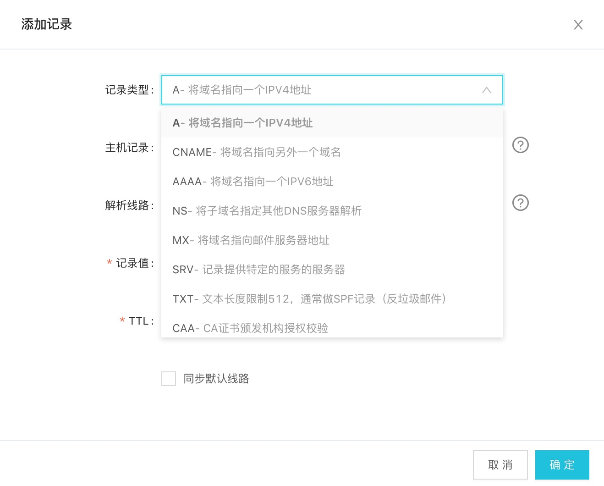
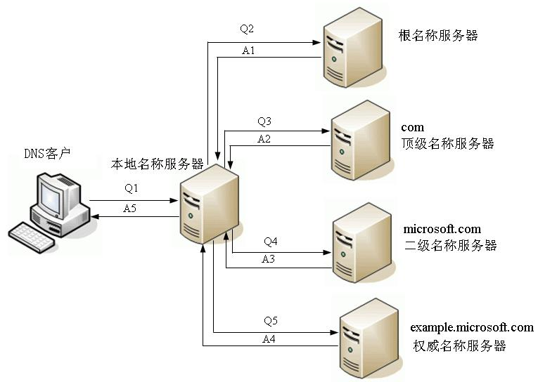
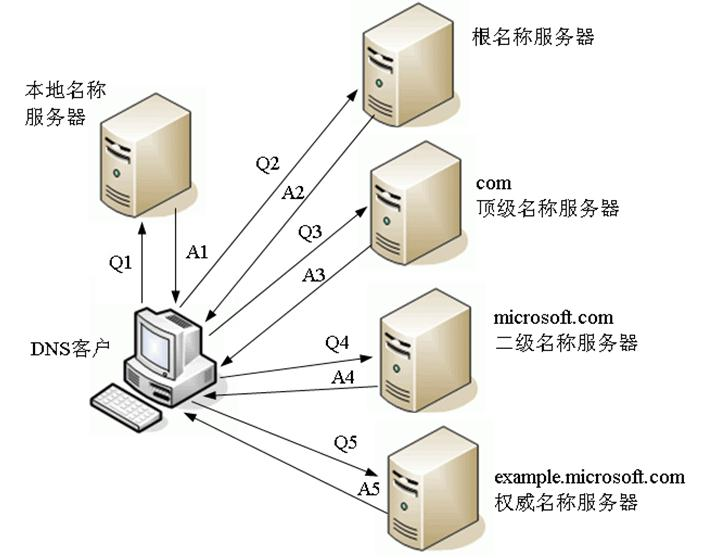

> 本章涉及dns查询工具[dig的使用](../基础概念/dig.md)

## 前言

我们都知道dns的作用是将域名解析为ip地址，dns是一个服务器，它也有自己的ip地址。那么第一个问题就出现了

- [dns服务器是如何分配的？或者如何设置的](#dns服务器)

清楚dns服务器的来源后，我们从解析域名的后台面板开始，如下图：



我们需要清楚几个名词

- 记录类型
    - A     ip地址
    - NS    名称服务器地址
    - CNAME 别名
- 记录值
    类型相应的值
- TTL
    查询缓存的时间，单位s，默认是10分钟，也就是600s

## dns服务器

先来了解域名的结构，每个域名其实看起来是这样的

```
iming.work.
```

末尾是有个点的，代表根域名，每一级域名都有自己的服务器。具体如图所示


- 根域名服务器
    全球只存在13台根域名服务器，国内有3台，当一个域名请求发出时，会查询离你最近的那台，每台根域名服务器包含了顶级域名的NS记录，而只有NS才知道下一级域名的相关信息。查询到顶级域名服务器的相关信息后将结果返回给请求者。
- 顶级域名服务器
     负责管理在该顶级域名服务器下注册的二级域名，请求者拿到根域名服务器的返回再次请求顶级域名服务器，去获取二级域名的相关信息。
- 权限域名服务器
    负责一个区的域名解析工作

你的电脑在没有配置dns服务器地址的时候就能上网是为什么呢？我们需要知道`DHCP`

全称是`Dynamic Host Configuration Protocol`，翻译过来是动态配置主机协议的服务器，通过DHCP协议获取IP、DNS、网关等。也就是说，一开始我们通过`DHCP`查询到本地`DNS服务器`

> 关于DHCP的工作原理可以查阅这3篇文章[DHCP服务器](https://www.jianshu.com/p/a2e1db7ac919)、[初始DNS服务器地址是哪里来的？](https://www.jianshu.com/p/daff7e0c1e3b)和[DHCP和DNS服务器的一些功能讲解](http://blog.51cto.com/vbers/2050140)

另外，我们也可以直接指定公网的`DNS服务器`地址去做解析，例如google的
```
8.8.8.8
4.2.2.2
```

## 解析过程

查询方法分为2种，一种是递归查询，一种是迭代查询

递归查询如下图所示



主机向本地域名服务器的查询一般都是采用递归查询。所谓递归查询就是：如果主机所询问的本地域名服务器不知道被查询的域名的IP地址，那么本地域名服务器就以DNS客户的身份，向其它根域名服务器继续发出查询请求报文(即替主机继续查询)，而不是让主机自己进行下一步查询。因此，递归查询返回的查询结果或者是所要查询的IP地址，或者是报错，表示无法查询到所需的IP地址。

迭代查询如下图所示


本地域名服务器向根域名服务器的查询的迭代查询。迭代查询的特点：当根域名服务器收到本地域名服务器发出的迭代查询请求报文时，要么给出所要查询的IP地址，要么告诉本地服务器：“你下一步应当向哪一个域名服务器进行查询”。然后让本地服务器进行后续的查询。

参考
- [DNS中的递归查询和迭代查询](https://www.jianshu.com/p/fc14b1526605)
- [例解DNS递归/迭代名称解析原理](https://blog.csdn.net/lycb_gz/article/details/11720247)

实例分析

```
dig +trace iming.work
```


