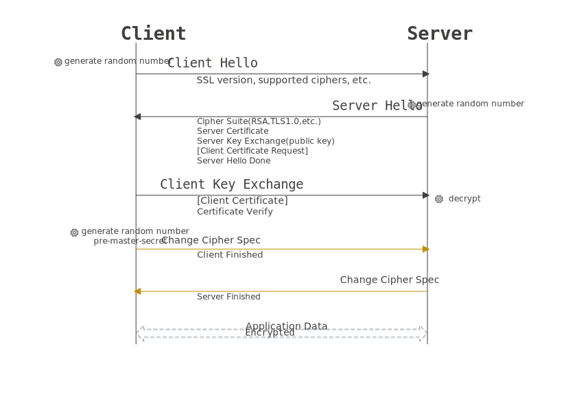

## https与非对称加密

本文阐述内容：

- 非对称加密概念
- ssl原理

## 非对称加密概念

非对称加密就是有2个密钥，公钥和私钥，它们都能互相加密解密一个数。

例如：x * 91 * 11 % 1000 = x
> x必须是一个三位数

在上面的运算中，x是用户想要加密的信息，91和11可以看作是公钥和私钥，也就是2个互质的整数。

原理是一个三位数*1001最后的末三位永远是本身，当`91*11 = 1001`这个数很小时，很简单的就能计算出来，当这个数很大的时候呢？

例如，我仍然可以再用2个质数相乘得到这样一个大整数，任意一个数乘以这个大整数后取余仍然是本身
```js
400000001 = 19801 * 20201

// 公钥 和 私钥 可以分别看作是19801和20201
// 得到的乘积末8位取余仍然是本身
```

去寻找这样2个质数相对来说比较简单，但是如果有人拆解这样一个大整数会更难。

参考：[如何用通俗易懂的话来解释非对称加密?](https://www.zhihu.com/question/33645891)

## ssl原理

ssl连接总是由客户端发起的，在建立连接后，客户端与服务器会经历**握手**环节，也就是**交换密钥**



SSL客户端（也是TCP的客户端）在TCP链接建立之后，发出一个ClientHello来发起握手，这个消息里面包含了自己可实现的算法列表和其它一些需要的消息，SSL的服务器端会回应一个ServerHello，这里面确定了这次通信所需要的算法，然后发过去自己的证书（里面包含了身份和自己的公钥）。Client在收到这个消息后会生成一个秘密消息，用SSL服务器的公钥加密后传过去，SSL服务器端用自己的私钥解密后，会话密钥协商成功，双方可以用同一份会话密钥来通信了。

参考：[SSL/TLS原理详解](https://segmentfault.com/a/1190000002554673)

## 总结

非对称加密依赖一个很大的整数，将这个整数因式分解得到2个互质的整数，这就是一个公钥私钥

由于传输这个很大的整数是不现实的，所以https采用了密钥交换，即通过证书（公钥）将对称加密的密钥传递给服务器

但是这又依赖了证书中公钥的安全

每个操作系统中内置了根证书，购买证书时，证书上的公钥+网站域名等先被hash处理后，再被证书机构用私钥加密一次，最终的结果就是签名

当你访问网站时，网站的https证书到达你的电脑，浏览器利用内置的根证书里的公钥去解密这个签名，只有解开的域名等信息一致时，浏览器才认为这是安全的。

最后得到对称加密的私钥，在会话期间都使用这个私钥进行数据加密与解密


