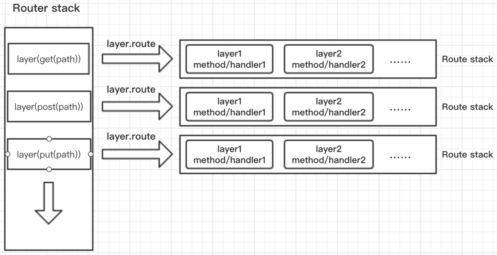

## Express中间件

### 概念

Express 是一个路由和中间件 Web 框架，其自身只具有最低程度的功能。

如果当前中间件函数没有结束请求/响应循环，那么它必须调用 next()，以将控制权传递给下一个中间件函数。否则，请求将保持挂起状态。

当调用了响应对象 (res) 的方法可以向客户机发送响应，并终止请求/响应循环。响应方法例如：

```js
res.send()
res.end()
res.render()
```

### 中间件类型

- 应用层中间件
- 路由器层中间件
- 错误处理中间件
- 内置中间件
- 第三方中间件

### 应用层中间件

主要是使用`app.use()`和`app.get()`来处理`IncomingMessage`，`next('route')`仅在`app.get()`时生效。

### 路由器层中间件

应用层中间件是将中间件绑定在app实例上，而路由器层中间件绑定在`express.Router()`实例上，用法

```js
router.use()
router.get()
```

最后还要将router挂载到app实例上才可以

```js
app.use('/', router)
```

### 错误处理中间件

在其他 app.use() 和路由调用之后，最后定义错误处理中间件

### 内置中间件

Express 中唯一内置的中间件函数是 `express.static()`

### 第三方中间件

例如`body-parser`等

### 源码分析

入口处express为一个构造函数，将app挂载`application`原型后，返回一个函数给`http.createServer`作为回调监听`IncomingMessage`

```js
function createApplication() {
  // 回调监听
  var app = function(req, res, next) {
    // 触发已注册的中间件
    app.handle(req, res, next);
  };

  // 继承EventEmitter
  mixin(app, EventEmitter.prototype, false);
  // 继承application
  mixin(app, proto, false);

  // 改写IncomingMessage实例变为可写并循环引用
  app.request = Object.create(req, {
    app: { configurable: true, enumerable: true, writable: true, value: app }
  })

  // 改写ServerResponse实例变为可写并循环引用
  app.response = Object.create(res, {
    app: { configurable: true, enumerable: true, writable: true, value: app }
  })

  // 初始化application
  app.init();
  return app;
}
```
紧接着来看`application.js`的内容，在程序的最后，我们以`app.listen(port)`来注册端口监听

```js
app.listen = function listen() {
  // this即为app.handle的调用
  var server = http.createServer(this);
  return server.listen.apply(server, arguments);
};
```
我们再来看`app.handle`

```js
app.handle = function handle(req, res, callback) {
  // 初始化的时候，callback肯定是没有的
  var router = this._router;

  // 兜底的错误处理函数
  var done = callback || finalhandler(req, res, {
    env: this.get('env'),
    onerror: logerror.bind(this)
  });

  // no routes
  if (!router) {
    debug('no routes defined on app');
    done();
    return;
  }

  // 最终的调用都指向了router.handle
  // 和app.use类似，最终都是router.use
  router.handle(req, res, done);
};
```

我们再来看`app.use`

```js
  fns.forEach(function (fn) {
    // non-express app
    if (!fn || !fn.handle || !fn.set) {
      // 第三方的中间件都是调用的router.use
      return router.use(path, fn);
    }

    // mounted an app
    fn.emit('mount', this);
  }, this);
```

最后我们再来看`router.use`和`router.handle`，都是通过`Layer`将`path`和回调`fn`管理在`this.stack`的数组中。

也就是说路由route和中间件一样都是通过`Layer`来处理。route的fn为`dispatch`，而中间件的fn为自定义的回调。

那在`router.handle`时如何区分时路由还是中间件？通过`layer.route`，我们可以看到在`new Layer`时二者的区别

```js
proto.route = function route(path) {
  var route = new Route(path);

  var layer = new Layer(path, {
    sensitive: this.caseSensitive,
    strict: this.strict,
    end: true
  }, route.dispatch.bind(route));

  // 将route赋值为本身
  layer.route = route;

  this.stack.push(layer);
  return route;
};

proto.use = function use(fn) {
    var layer = new Layer(path, {
      sensitive: this.caseSensitive,
      strict: false,
      end: false
    }, fn);

    // 将route置为undefined
    layer.route = undefined;
}
```

最终的路由和中间件处理都在`router.handle`中，在整个Router路由系统中stack 存放着一个个layer, 通过layer.route 指向route路由对象, route的stack的里存放的也是一个个layer，每个layer中包含(method/handler)。



```js
// 缓存查询
self.process_params(() => {
  // 如果route存在，这处理请求的handle，进一步处理route.stack
  if (route) {
    return layer.handle_request(req, res, next);
  }
})
```
