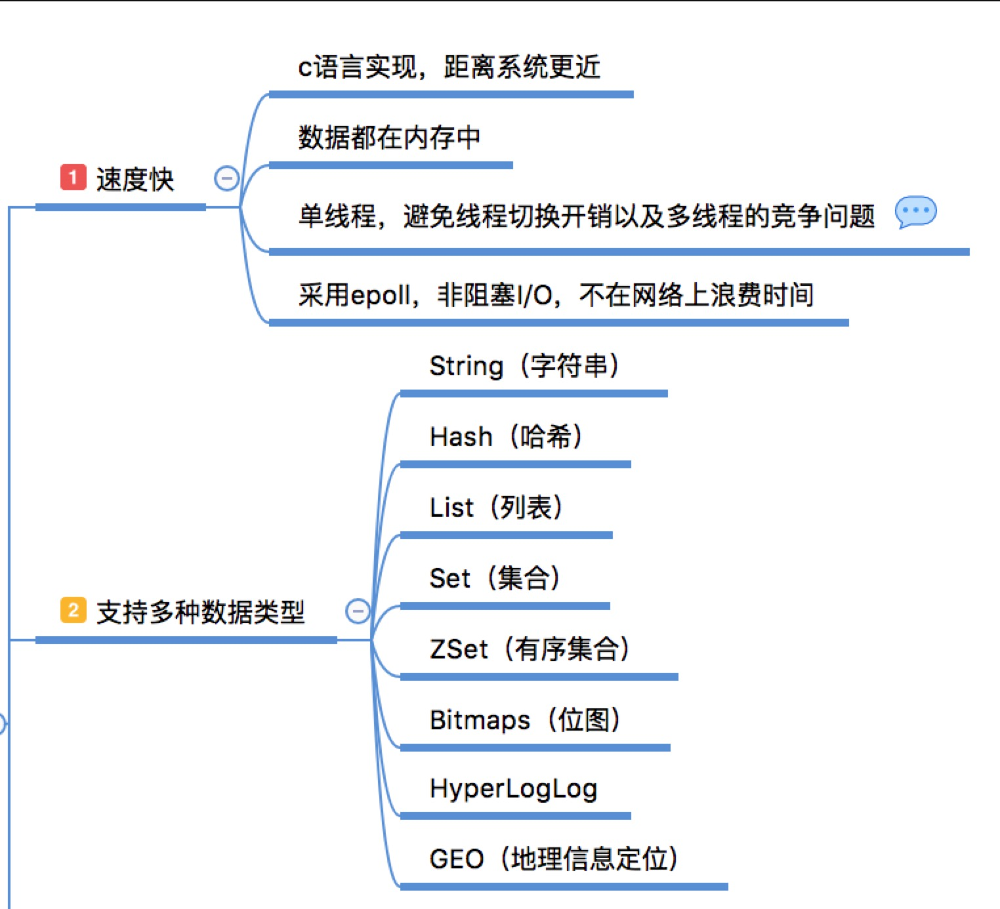

> 本文仅仅对redis及node redis client入门，深入全面可查阅[为什么要用Redis](https://juejin.im/post/5b516dc75188251af363492d)

## 概述

redis是基于`BSD协议`的，关于[各种协议的介绍](http://www.runoob.com/w3cnote/open-source-license.html)

redis的操作是原子性的（要么完全成功、要么完全失败）

redis支持五种数据类型：string（字符串），hash（哈希），list（列表），set（集合）及zset(sorted set：有序集合)。

## node_redis

redis分为redis-server和redis-cli，这里的node_redis仅仅是client，服务还是要自己单独起的，否则你会看到这样的报错
```
Unhandled rejection Error: Redis connection to 127.0.0.1:811 failed - connect ECONNREFUSED 127.0.0.1:811
    at TCPConnectWrap.afterConnect [as oncomplete] (net.js:1163:14)
```

mac下操作redis

```
brew install redis

# 启动
brew services start redis

# 或
redis-server /usr/local/etc/redis.conf

# 关闭
brew services stop redis
redis-cli shutdown
```

node_redis也继承了`EventEmitter`，所以事件都是以回调的形式，改为`Promise`的话可以借用[bluebird](https://github.com/petkaantonov/bluebird)库
```js
bluebird.promisifyAll(redis)
```

这样你就可以用promise为所欲为了

```js
client.onAsync('error').then(err => {
    console.log(err)
})
```

## node_redis命令

在node_redis命令中，都是原生Redis Command的实现，redis命令的分类

- [对`redis 键`的相关操作](#对redis-键的相关操作)
- [对`string`的相关操作](#string-commands)
- [对`hash`的相关操作](#hash-commands)
- [对`list`的相关操作](#list-commands)
- [对`set`的相关操作](#set-commands)
- [对`zset`的相关操作](#zset-commands)

例如判断一个key是否存在，原生的操作为
```
EXISTS key
```
node_redis中
```js
client.exists('key', callback)
// promisify后
client.exists('key').then(console.log)
```

所有操作都会接受一个callback回调，和fs类似，第一个参数都是`error`，第二个参数是返回结果`reply`，都会有2种表示：

回调
```js
client.set(key, value, (err, reply) => {})
```
Promise
```js
client.set(key, value).then(reply => {}).catch(err => {})
```

### string commands

Redis 字符串数据类型的相关命令用于管理 redis 字符串值

```js
client.set(key, value)
client.append(key, value) // key存在，追加value
client.strlen(key)  // 获取长度
client.getset(key, value)  // 设置key值，并且返回old value
client.get(key)
client.mget(key1, key2[, ...]) // 批量获取
client.incr(key)    // 将key+1
client.incrby(key, increment) // 将key+increment
client.decr(key)    // 将key-1
client.decrby(key, decrement)   // 将key-decrement
```

### hash commands

hash 是一个string类型的field和value的映射表，hash特别适合用于存储对象。

所有的操作前都加了`H`作为区分

```js
hset(key, field, value)
hsetnx(key, field, value)   // 只有在field字段不存在时设置value
hmset(key, field1, value1[, field2, value2])    // 批量设置
hincrby(key, field, increment)
hexists(key, field) // 查看hash表key中，field字段是否存在
hget(key, field) // 取出key表中的field字段
hgetall(key) // 取出key表所有字段和值
hkeys(key)  // 取出key表所有字段
hvals(key) // 取出所有的值
```

### list commands
列表是简单的字符串列表，按照插入顺序排序。你可以添加一个元素到列表的头部（左边）或者尾部（右边）

```js
lpush(key, val[, val2]) // 插入到列表的头部
lpushx(key, val) // 插入到已存在的列表头部
lset(key, index, val) // 通过索引设置val
lindex(key, index)  // 通过索引获取元素
lpop(key) // 移除并获取第一个元素
```

### set commands

### zset commands

-----

## redis原生命令

详细分为

- 对`redis 键`的相关操作
- 对`string`的相关操作
- 对`hash`的相关操作
- 对`list`的相关操作
- 对`set`的相关操作
- 对`zset`的相关操作

### 对`redis 键`的相关操作

命令|描述
-----|-----
`DEL` key|key存在时删除
`EXISTS` key|检查key是否存在
`EXPIRE` key seconds|为key设置过期时间seconds
`EXPIREAT` key timestamp|同上，timestamp为`UNIX`时间戳
`PEXPIRE` key milliseconds|单位毫秒
`PEXPIREAT` key milli-timestamp|同上
`KEYS` pattern|根据pattern匹配查找
`PERSIST` key|移除过期时间
`PTIL` key|返回剩余的过期时间，单位毫秒
`TIL` key|同上，单位秒
`RENAME` key newkey|重命名
`TYPE` key|返回key的类型

## 为什么要用Redis?




hint: 发布订阅的channel和message不要使用中文！否则不会触发message事件